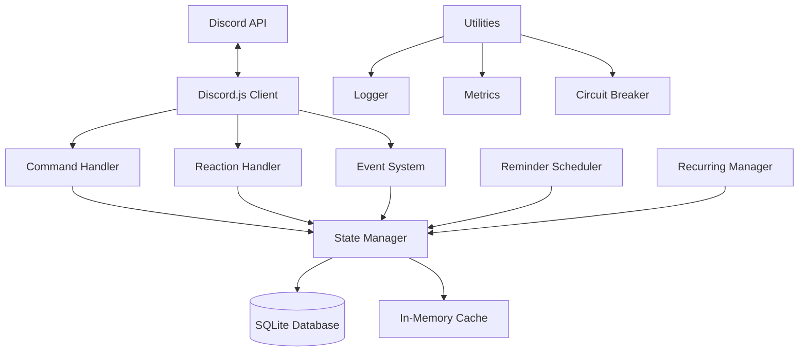
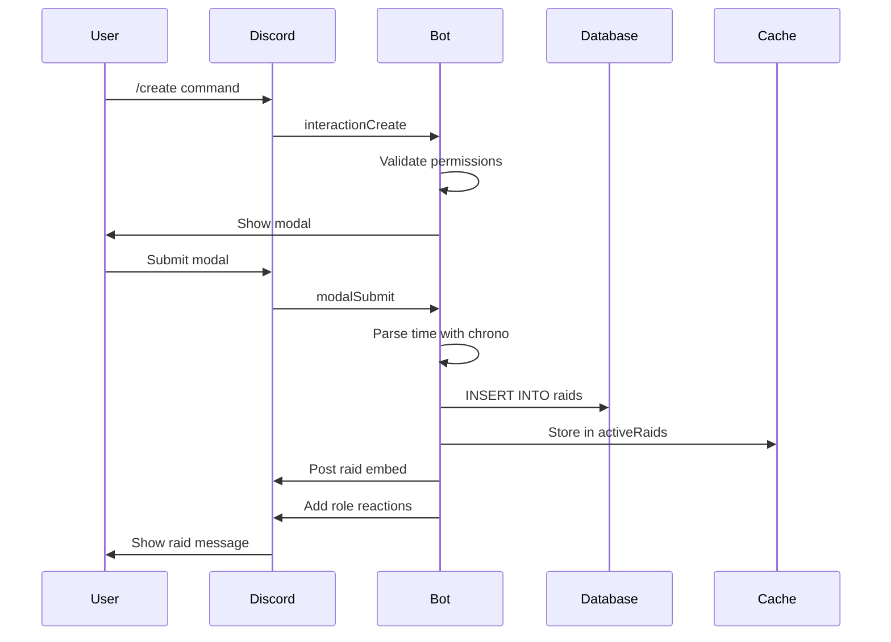
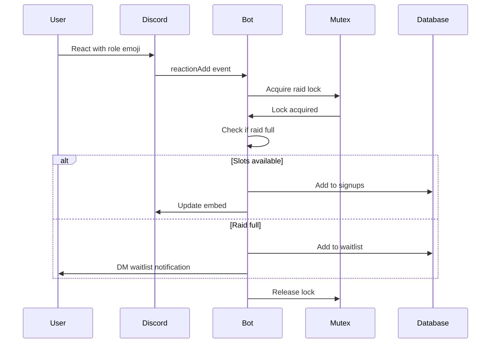

## System Architecture

RaidBot is built as a Discord.js application with a layered architecture that separates concerns and enables maintainability at scale.

### High-Level Architecture



### Core Components

#### 1. Bot Core (`bot.js`)

The main entry point that orchestrates the entire application:

```javascript bot.js
const client = new Client({
    intents: [
        GatewayIntentBits.Guilds,
        GatewayIntentBits.GuildMessages,
        GatewayIntentBits.GuildMessageReactions,
        GatewayIntentBits.GuildMembers
    ],
    partials: [Partials.Message, Partials.Channel, Partials.Reaction]
});
```

**Responsibilities:**
- Initialize Discord client with required intents
- Load all state from database on startup
- Register slash commands globally
- Route interactions to command handlers
- Handle graceful shutdown with state preservation

See implementation at `bot.js:1-413`

#### 2. State Management (`state.js`)

Hybrid state management using in-memory caches backed by SQLite:

```javascript state.js
// In-memory caches for fast access
const activeRaids = new Map();
const raidChannels = new Map();
const guildSettings = new Map();
const raidStats = new Map();

// Prepared statements for database operations
function getStatements() {
    return {
        getRaid: prepare('SELECT * FROM raids WHERE message_id = ?'),
        insertRaid: prepare('INSERT INTO raids ...'),
        updateRaid: prepare('UPDATE raids ...')
    };
}
```

**Key Features:**
- Fast in-memory reads with Map structures
- Immediate database writes for persistence
- Prepared statements for optimal query performance
- Lazy loading with cache-aside pattern

See implementation at `state.js:1-800`

#### 3. Database Layer (`db/database.js`)

SQLite database with better-sqlite3 for synchronous, high-performance access:

```javascript db/database.js
const db = new Database(DB_PATH);

// Enable WAL mode for better concurrent performance
db.pragma('journal_mode = WAL');
db.pragma('foreign_keys = ON');

function initializeSchema() {
    const schema = fs.readFileSync(SCHEMA_PATH, 'utf8');
    db.exec(schema);
    runMigrations();
}
```

**Schema Design:**
- `guilds` - Guild configuration and channel settings
- `raids` - Active and historical raid data
- `signups` - Normalized signup data with role assignments
- `user_stats` - Global and per-guild participation statistics
- `recurring_raids` - Scheduled recurring raid configurations

See schema at `db/schema.sql:1-200`

#### 4. Command System (`commands/`)

Slash command handlers using Discord.js command builders:

```javascript commands/create.js
module.exports = {
    data: new SlashCommandBuilder()
        .setName('create')
        .setDescription('Create a new raid or museum signup'),
    requiresManageGuild: true,
    async execute(interaction) {
        // Show modal for raid creation
        await interaction.showModal(modal);
    }
};
```

**Command Features:**
- Permission-based access control
- Rate limiting per user
- Structured error handling
- Metrics collection for monitoring

See examples at `commands/create.js`, `commands/raid.js`

#### 5. Reaction Handlers (`raids/reactionHandlers.js`)

Concurrency-safe reaction processing with mutex locks:

```javascript raids/reactionHandlers.js
const locks = new Map(); // messageId -> Mutex

async function handleReactionAdd(reaction, user) {
    // Acquire mutex lock for this specific raid
    const lock = getLock(reaction.message.id);
    const release = await lock.acquire();
    
    try {
        // Process signup atomically
        if (raidData.closed) {
            await reaction.users.remove(user.id);
            return;
        }
        // ... signup logic
    } finally {
        release();
    }
}
```

**Concurrency Control:**
- Per-raid mutex locks prevent race conditions
- Rate limiting prevents spam (5 reactions/10s per user)
- Atomic signup operations with database transactions

See implementation at `raids/reactionHandlers.js:14-100`

## Design Patterns

### 1. Circuit Breaker Pattern

Protects against cascading failures when Discord API is degraded:

```javascript utils/circuitBreaker.js
class CircuitBreaker {
    async execute(fn, fallback = null) {
        if (this.state === State.OPEN) {
            if (Date.now() < this.nextAttempt) {
                // Circuit is open, reject immediately
                return fallback ? fallback() : throw Error();
            }
            this.state = State.HALF_OPEN;
        }
        
        try {
            const result = await fn();
            this.onSuccess();
            return result;
        } catch (error) {
            this.onFailure(error);
            return fallback ? fallback() : throw error;
        }
    }
}
```

**States:**
- **CLOSED** - Normal operation
- **OPEN** - Too many failures, reject immediately
- **HALF_OPEN** - Testing recovery with limited requests

See implementation at `utils/circuitBreaker.js:19-220`

### 2. Rate Limiter

Sliding window rate limiting for reactions and commands:

```javascript utils/rateLimiter.js
class RateLimiter {
    isAllowed(key) {
        const now = Date.now();
        const timestamps = this.requests.get(key) || [];
        
        // Remove old timestamps outside the window
        const validTimestamps = timestamps.filter(
            ts => now - ts < this.windowMs
        );
        
        if (validTimestamps.length >= this.maxRequests) {
            return false;
        }
        
        validTimestamps.push(now);
        this.requests.set(key, validTimestamps);
        return true;
    }
}

// Pre-configured limiters
const reactionLimiter = new RateLimiter({ 
    maxRequests: 5, 
    windowMs: 10000 
});
```

See implementation at `utils/rateLimiter.js:5-124`

### 3. Structured Logging

Contextual logging with multiple severity levels:

```javascript utils/logger.js
const logger = new Logger({
    level: process.env.LOG_LEVEL || 'INFO',
    colorize: true,
    logToFile: process.env.LOG_TO_FILE === 'true'
});

logger.info('Raid created', {
    raidId: 'A1',
    guildId: '123',
    userId: '456',
    timestamp: 1234567890
});

// Output:
// [2026-03-03T10:30:00.000Z] [INFO] [wizbot] Raid created
// { raidId: 'A1', guildId: '123', ... }
```

**Features:**
- Structured JSON logging for production
- Colorized console output for development
- File rotation at 5MB threshold
- Child loggers with additional context

See implementation at `utils/logger.js:24-210`

### 4. Optimistic Locking

Prevents lost updates in concurrent raid modifications:

```javascript state.js
function updateActiveRaid(messageId, updates) {
    const raid = activeRaids.get(messageId);
    const currentVersion = raid.version || 1;
    
    // Increment version
    const newVersion = currentVersion + 1;
    
    // Atomic update with version check
    const result = prepare(`
        UPDATE raids 
        SET ..., version = ? 
        WHERE message_id = ? AND version = ?
    `).run(newVersion, messageId, currentVersion);
    
    if (result.changes === 0) {
        throw new Error('Concurrent modification detected');
    }
}
```

See implementation at `state.js:100-200`

## Data Flow

### Raid Creation Flow



### Signup Flow with Waitlist



## Performance Optimizations

### 1. Database Performance

<Info>
RaidBot uses better-sqlite3 with WAL mode for optimal concurrent read/write performance.
</Info>

```javascript
// Write-Ahead Logging for concurrent access
db.pragma('journal_mode = WAL');

// Prepared statements cached for reuse
const statements = {
    getRaid: db.prepare('SELECT * FROM raids WHERE message_id = ?')
};

// Transactions for bulk operations
const insertMany = db.transaction((raids) => {
    for (const raid of raids) {
        statements.insertRaid.run(raid);
    }
});
```

### 2. Memory Management

```javascript
// LRU eviction in rate limiters
if (!this.requests.has(key) && this.requests.size >= this.maxEntries) {
    const oldestKey = this.requests.keys().next().value;
    this.requests.delete(oldestKey);
}

// Periodic cleanup of old entries
setInterval(() => {
    reactionLimiter.cleanup();
    commandCooldowns.cleanup();
}, 60 * 1000);
```

### 3. Batched DM Sending

```javascript reminderScheduler.js
const DM_BATCH_SIZE = 5;
const DM_BATCH_DELAY_MS = 1200;

// Send DMs in batches to avoid rate limits
for (let i = 0; i < userIds.length; i += DM_BATCH_SIZE) {
    const batch = userIds.slice(i, i + DM_BATCH_SIZE);
    await Promise.all(batch.map(userId => sendDM(userId)));
    
    if (i + DM_BATCH_SIZE < userIds.length) {
        await sleep(DM_BATCH_DELAY_MS);
    }
}
```

See implementation at `reminderScheduler.js:14-100`

## Error Handling

### User-Friendly Error Messages

```javascript utils/errorMessages.js
const ERROR_MESSAGES = {
    RATE_LIMITED: 'You\'re doing that too quickly!',
    MISSING_MANAGE_GUILD: 'You need the Manage Server permission.',
    RAID_FULL: 'This raid is full. You\'ve been added to the waitlist.',
    RAID_CLOSED: 'Signups for this raid are closed.'
};

function formatError(error) {
    if (error.code === 50007) {
        return 'Unable to send you a DM. Please enable DMs from server members.';
    }
    return getErrorMessage('UNKNOWN_ERROR');
}
```

### Graceful Degradation

```javascript bot.js
async function gracefulShutdown(signal) {
    logger.info(`Received ${signal}, starting graceful shutdown...`);
    
    try {
        // Save all pending state
        saveActiveRaidState();
        
        // Destroy the Discord client
        await client.destroy();
        
        // Close database connection
        closeDatabase();
        
        logger.info('Graceful shutdown complete');
        process.exit(0);
    } catch (error) {
        logger.error('Error during shutdown', { error });
        process.exit(1);
    }
}

process.on('SIGTERM', () => gracefulShutdown('SIGTERM'));
process.on('SIGINT', () => gracefulShutdown('SIGINT'));
```

See implementation at `bot.js:349-377`

## Monitoring & Observability

### Metrics Collection

```javascript utils/metrics.js
function incrementCounter(name, labels = {}) {
    const key = JSON.stringify({ name, ...labels });
    counters.set(key, (counters.get(key) || 0) + 1);
}

function recordHistogram(name, value, labels = {}) {
    const key = JSON.stringify({ name, ...labels });
    if (!histograms.has(key)) {
        histograms.set(key, []);
    }
    histograms.get(key).push(value);
}

// Track command execution
incrementCounter('commands_total', { command: 'create' });
recordHistogram('command_duration_seconds', 0.45, { command: 'create' });
```

### Performance Alerts

```javascript utils/alerts.js
function initializeAlerts(client, ownerId) {
    // Monitor bot latency every 5 minutes
    setInterval(async () => {
        const latency = client.ws.ping;
        
        if (latency > LATENCY_THRESHOLD_MS) {
            await sendAlert(ownerId, {
                type: 'HIGH_LATENCY',
                latency: `${latency}ms`,
                threshold: `${LATENCY_THRESHOLD_MS}ms`
            });
        }
    }, 5 * 60 * 1000);
}
```

See implementation at `utils/alerts.js:1-200`

## Testing Strategy

See the [Testing Guide](/development/testing) for detailed information on writing and running tests.

## Next Steps

<CardGroup cols={2}>
  <Card title="Project Structure" icon="folder-tree" href="/development/project-structure">
    Explore the codebase organization
  </Card>
  <Card title="Testing Guide" icon="flask" href="/development/testing">
    Learn how to write and run tests
  </Card>
  <Card title="Contributing" icon="code-pull-request" href="/development/contributing">
    Start contributing to RaidBot
  </Card>
</CardGroup>