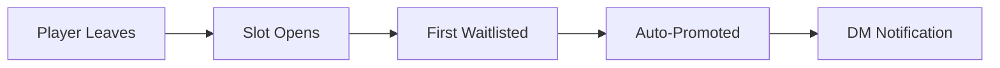

# Museum Signups

Museum signups are streamlined events designed for activities that don't require specific roles — like museum runs, housing tours, or casual group content.

## What Makes Museum Signups Different?

Unlike regular raids with specific roles (Vanguard, Support, etc.), museum signups have:

<CardGroup cols={2}>
  <Card title="Single Reaction" icon="check">
    One ✅ reaction for all players (no role selection needed)
  </Card>
  <Card title="12 Player Cap" icon="users">
    Default maximum of 12 participants (configurable)
  </Card>
  <Card title="First-Come Basis" icon="clock">
    Players fill slots in order — no role balancing needed
  </Card>
  <Card title="Automatic Waitlist" icon="list">
    Overflow users automatically added to waitlist
  </Card>
</CardGroup>

## Creating a Museum Signup

You can create museum signups via the `/create` command or recurring schedules.

### Via Create Command

<Steps>
  <Step title="Start creation">
    Run `/create` to open the interactive raid builder.
  </Step>
  
  <Step title="Select Museum">
    From the type dropdown, choose "Museum Signup" (marked with 🏛️ emoji).
  </Step>
  
  <Step title="Set time">
    Click "Set Time" and enter when the event occurs:
    ```
    tomorrow 3pm
    Saturday 2pm
    next week 6pm
    ```
  </Step>
  
  <Step title="Create">
    Click "Create" to post the signup. The bot automatically adds the ✅ reaction.
  </Step>
</Steps>

### Via Recurring Schedule

For weekly museum events:

```bash
/recurring action:create
# Select: Museum Signup
# Schedule: Weekly on desired day/time
```

See [Recurring Raids](/features/recurring-raids) for detailed setup instructions.

## Signup Embed Format

Museum signup messages look like this:

```yaml
Title: Museum Signup
Description: React with ✅ to reserve a slot. Max 12 players.

Date + Time: Saturday, March 15, 2026 at 2:00 PM EST

Signups (8/12):
  1. @PlayerOne
  2. @PlayerTwo
  3. @PlayerThree
  4. @PlayerFour
  5. @PlayerFive
  6. @PlayerSix
  7. @PlayerSeven
  8. @PlayerEight

Waitlist (2):
  1. @PlayerNine
  2. @PlayerTen

Raid ID: abc123
Created by @RaidLeader
```

## How Players Sign Up

<Steps>
  <Step title="React with ✅">
    Click the ✅ reaction under the signup message.
  </Step>
  
  <Step title="Automatic assignment">
    If slots are available:
    - Player is added to the numbered list
    - Embed updates immediately
    
    If full:
    - Player is added to the waitlist
    - Notified via DM they're on standby
  </Step>
  
  <Step title="Remove reaction to cancel">
    Click ✅ again to remove your signup.
  </Step>
</Steps>

<Info>
  Players can only sign up once — they can't be on both the main roster and waitlist simultaneously.
</Info>

## Waitlist System

The waitlist automatically manages overflow participants.

### Automatic Promotion

When a main roster player drops:



The first person on the waitlist is:
1. Moved to the main roster
2. Sent a DM notification
3. Pinged in the raid thread (if enabled)

### Waitlist Notifications

Promoted users receive a DM like:

```
You've been promoted from the waitlist!

Event: Museum Signup
Time: Saturday, March 15 at 2:00 PM EST
Raid ID: abc123

[View Signup]
```

## Managing Museum Signups

Use the standard raid management panel:

```bash
/raid raid_id:abc123
```

### Available Actions

<Tabs>
  <Tab title="Close">
    Lock the signup — no new reactions accepted.
    
    Use this when:
    - Event is about to start
    - Roster is finalized
    - No longer accepting signups
  </Tab>
  
  <Tab title="Reopen">
    Re-enable signups after closing.
    
    Use this when:
    - Need to fill last-minute openings
    - Event was rescheduled
    - Accidentally closed too early
  </Tab>
  
  <Tab title="Change Time">
    Update the event time without recreating the signup.
    
    ```
    New time: next Saturday 3pm
    ```
    
    Participants are not automatically notified — announce changes manually.
  </Tab>
  
  <Tab title="Mark No-Show">
    Record which players signed up but didn't attend (after event closes).
    
    This updates `/stats user` data for reliability tracking.
  </Tab>
  
  <Tab title="Duplicate">
    Clone the museum signup for a different time.
    
    Museum duplicates always start with an empty roster.
  </Tab>
</Tabs>

<Note>
  **Change Length** and **Find Sub** are disabled for museum signups (they only apply to role-based raids).
</Note>

## Manual Roster Management

Admins can manually add/remove players using `/raidsignup`.

### Add a Player

```bash
/raidsignup action:assign raid_id:abc123 user:@Player
```

Adds the user to the main roster (or waitlist if full).

### Remove a Player

```bash
/raidsignup action:remove raid_id:abc123 user:@Player
```

Removes the user and promotes the next waitlisted player.

### Move to Waitlist

```bash
/raidsignup action:waitlist raid_id:abc123 user:@Player
```

Moves a main roster player to the waitlist (frees a slot for promotion).

<Warning>
  Manual changes trigger the same waitlist promotion logic as player reactions. Always check the embed after making changes.
</Warning>

## Use Cases

<CardGroup cols={2}>
  <Card title="Museum Tours" icon="landmark">
    Coordinate group visits to in-game museums or exhibits.
  </Card>
  
  <Card title="Housing Tours" icon="house">
    Organize house visits with player count limits.
  </Card>
  
  <Card title="Social Events" icon="user-group">
    Casual meetups, fashion shows, or competitions.
  </Card>
  
  <Card title="Non-Combat Content" icon="heart">
    Any activity where specific roles aren't needed.
  </Card>
</CardGroup>

## Best Practices

<Tip>
  **Set realistic caps** based on instance limits. The default 12 works for most content, but you can create custom templates with different limits.
</Tip>

<Tip>
  **Close signups 5-10 minutes before start** to lock the roster and prevent last-second changes.
</Tip>

<Tip>
  **Enable threads** in server settings so each museum event gets its own discussion thread for coordination.
</Tip>

## Customizing Museum Capacity

The default 12-player cap can be modified via custom templates:

<Steps>
  <Step title="Contact server admin">
    Museum capacity is set when creating the template.
  </Step>
  
  <Step title="Create custom museum template">
    Your admin can create templates with different `maxSlots` values:
    - Small events: 4-8 players
    - Standard: 12 players
    - Large: 16-20 players
  </Step>
  
  <Step title="Use the custom template">
    Select it from `/create` or recurring raid setup.
  </Step>
</Steps>

<Info>
  Template customization requires server configuration access. See [Templates](/essentials/templates) for details.
</Info>

## Participation Tracking

Museum signups count toward user statistics:

- Total raid count (`/stats user`)
- Weekly participation (`/stats weekly`)
- Monthly reports (`/stats monthly`)
- Attendance rate calculations
- No-show tracking (if recorded)

**View stats:**
```bash
/stats user user:@Player
```

Museum events appear as "Museum" in the "Favorite Raid Type" field.

## Differences from Regular Raids

| Feature | Museum Signups | Regular Raids |
|---------|----------------|---------------|
| **Role Selection** | No roles | Multiple roles (Vanguard, Support, etc.) |
| **Reactions** | Single ✅ | One emoji per role |
| **Capacity** | Fixed total (default 12) | Per-role slot counts |
| **Waitlist** | Single global list | Per-role waitlists |
| **Side Assignment** | N/A | Supported (Lemuria raids) |
| **Find Sub** | Not available | Smart role-based matching |
| **Roster Copy** | Not supported | Works with recurring raids |

## Troubleshooting

<AccordionGroup>
  <Accordion title="Player can't react">
    - Check if raid is closed
    - Verify player has permission to add reactions in the channel
    - Try removing and re-adding reaction
  </Accordion>
  
  <Accordion title="Waitlist not promoting">
    - Ensure the previous player's reaction was fully removed
    - Check bot permissions (Manage Messages required)
    - Verify the user being promoted can receive DMs from the bot
  </Accordion>
  
  <Accordion title="Can't find the Raid ID">
    - Look at the very bottom of the signup embed
    - Format: `Raid ID: abc123`
    - Use this exact ID (case-sensitive) in commands
  </Accordion>
</AccordionGroup>

## Related Features

- [Raid Management](/features/raid-management) - Management panel and controls
- [Recurring Raids](/features/recurring-raids) - Automate weekly museum events
- [Stats & Analytics](/features/stats-analytics) - Track museum participation
