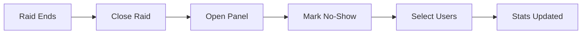

# Raid Management

RaidBot provides a comprehensive raid management system with an interactive control panel that lets you manage every aspect of your raid signups from a single interface.

## Creating a Raid

Use the `/create` command to start an interactive raid creation flow.

<Steps>
  <Step title="Start the creation flow">
    Run `/create` to open the interactive raid builder. You'll see a summary embed that updates as you make selections.
  </Step>
  
  <Step title="Select raid type">
    Choose from:
    - Custom raid templates configured for your server
    - Museum signups (12 player slots)
    - Key boss events (team-based)
    - Challenge mode dungeons (team-based)
  </Step>
  
  <Step title="Set date and time">
    Click "Set Time" and enter a natural language time like:
    - `tomorrow 7pm`
    - `Friday 8:30pm`
    - `next Saturday at 6pm`
    
    You can also use Unix timestamps for precise scheduling.
  </Step>
  
  <Step title="Configure options (if applicable)">
    Depending on your raid type:
    - **Key length**: Choose 1.5 or 3 hours
    - **Strategy**: Select farming or questing approach
    - **Team count**: Set number of teams (for team-based events)
    - **Boss/dungeon name**: Custom label for the event
  </Step>
  
  <Step title="Submit">
    Click "Create" to post the signup message to your configured channel. The bot will automatically add reaction emojis for each role.
  </Step>
</Steps>

<Note>
  The raid will automatically create a discussion thread if threads are enabled in your server settings.
</Note>

## Management Panel

After creating a raid, use `/raid raid_id:<id>` to open the interactive management panel. The Raid ID is shown at the bottom of every signup embed.

### Panel Features

The management panel provides these controls:

<CardGroup cols={2}>
  <Card title="Close Signup" icon="lock">
    Closes the raid for new signups. Existing participants remain locked in. Useful when the raid is full or about to start.
  </Card>
  
  <Card title="Reopen Signup" icon="lock-open">
    Reopens a closed raid to allow new signups. Participants can react again to join.
  </Card>
  
  <Card title="Delete" icon="trash">
    Permanently removes the raid signup message and all associated data.
  </Card>
  
  <Card title="Change Time" icon="clock">
    Opens a modal to update the raid time. Accepts natural language or Unix timestamps.
    ```
    Example: "tomorrow 7pm" or "1735689600"
    ```
  </Card>
  
  <Card title="Change Length" icon="hourglass">
    Switch between 1.5 and 3 hour keys (regular raids only).
  </Card>
  
  <Card title="Mark No-Show" icon="x">
    Record users who signed up but didn't attend. Only enabled after raid is closed.
  </Card>
  
  <Card title="Find Sub" icon="magnifying-glass">
    Smart substitute finder that ranks candidates by:
    - Experience in the needed role
    - Availability at the raid time
    - Recent activity
    - Total raid participation
  </Card>
  
  <Card title="Duplicate" icon="copy">
    Clone the raid with a new time. Option to copy the current roster or start fresh.
  </Card>
</CardGroup>

## Finding Substitutes

The Find Sub feature uses intelligent matching to help you fill last-minute openings.

<Steps>
  <Step title="Select the role">
    From the management panel, click "Find Sub" and choose which role needs coverage.
  </Step>
  
  <Step title="Review candidates">
    The bot shows up to 5 top candidates with:
    - Number of times they've played this role
    - Total raid participation
    - Availability status (if they've set their schedule)
    
    Example output:
    ```
    1. @PlayerName — 15x Vanguard, 42 total raids ✅ available
    2. @OtherPlayer — 8x Vanguard, 23 total raids
    3. @ThirdPlayer — 5x Vanguard, 31 total raids ✅ available
    ```
  </Step>
  
  <Step title="Contact the sub">
    Reach out to your top candidates to see if they can fill the spot.
  </Step>
</Steps>

<Info>
  The availability check cross-references user availability data (from `/availability set`) with the raid timestamp to show who's explicitly marked as free.
</Info>

## Managing No-Shows

Track reliability by recording when signed-up users don't attend.



<Steps>
  <Step title="Close the raid">
    No-show marking is only available for closed raids.
  </Step>
  
  <Step title="Select no-show users">
    From the management panel, click "Mark No-Show" and select users from the dropdown (supports multi-select up to 25 users).
  </Step>
  
  <Step title="Confirm">
    The bot records the no-shows and updates user statistics. This data appears in `/stats user` reports.
  </Step>
</Steps>

<Warning>
  No-show counts affect user statistics and can help leadership identify reliability issues.
</Warning>

## Duplicating Raids

Quickly create recurring events by duplicating existing raids.

<CodeGroup>
```text Regular Raids
1. Set new date/time (e.g., "next week 7pm")
2. Choose to copy roster or start empty
3. Raid created with same template and settings
```

```text Museum/Team Events
1. Set new date/time
2. Always starts with empty roster
3. Same configuration (team count, etc.)
```
</CodeGroup>

### Use Cases

- **Weekly farm runs**: Duplicate your weekly farming raid with the same roster
- **Practice raids**: Clone a raid composition for a different day
- **Backup schedules**: Create alternate time slots for the same event

## Audit Logging

All management actions are logged to your configured audit channel:

- Raid created/deleted
- Time or length changes
- Close/reopen actions
- No-show recordings
- Roster modifications via `/raidsignup`

Each log includes:
- Who performed the action
- Timestamp
- Raid ID
- Specific changes made
- Link to the raid message

## Best Practices

<Tip>
  **Close raids 5-10 minutes before start time** to lock in the roster and prevent last-second changes.
</Tip>

<Tip>
  **Use the duplicate feature** for recurring weekly events instead of manually recreating each time.
</Tip>

<Tip>
  **Record no-shows consistently** to build accurate participation statistics for your community.
</Tip>

## Related Features

- [Recurring Raids](/features/recurring-raids) - Automate raid creation on a schedule
- [Museum Signups](/features/museum-signups) - Special 12-player events
- [Stats & Analytics](/features/stats-analytics) - View participation and no-show data
