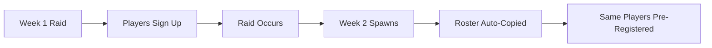

# Recurring Raids

Set up automatic raid signup creation on a weekly, daily, or custom interval basis. Perfect for guilds that run regular farming events or scheduled activities.

## Overview

Recurring raids automatically spawn signup messages at configured times, optionally copying participants from previous instances to pre-fill rosters.

**Key Features:**
- Weekly, daily, or custom interval schedules
- Separate spawn time (when signup appears) vs raid time (when event occurs)
- Optional roster copying from previous instance
- Role mentions when signups appear
- Natural language time input

## Creating a Recurring Raid

Use `/recurring action:create` to start the interactive setup flow.

<Steps>
  <Step title="Select raid template">
    Choose the type of raid:
    - Museum Signup
    - Any custom raid template configured for your server
    
    This determines the roles, layout, and signup format.
  </Step>
  
  <Step title="Choose schedule type">
    Select how often the raid should recur:
    
    <AccordionGroup>
      <Accordion title="Weekly">
        Raid occurs on the same day each week (e.g., every Monday at 7pm)
        
        **Best for:**
        - Weekly farm runs
        - Scheduled raid nights
        - Regular dungeon clears
      </Accordion>
      
      <Accordion title="Daily">
        Raid occurs every day at the same time
        
        **Best for:**
        - Daily quests
        - High-frequency farming
        - Drop events
      </Accordion>
      
      <Accordion title="Custom Interval">
        Raid occurs every N hours (e.g., every 24 hours, every 48 hours)
        
        **Best for:**
        - Boss respawn timers
        - Flexible scheduling
        - Non-standard intervals
      </Accordion>
    </AccordionGroup>
  </Step>
  
  <Step title="Set time and timezone">
    Enter when the raid should occur:
    
    ```text Time Examples
    7pm
    7:00 PM
    19:00
    8:30pm
    ```
    
    Specify your timezone:
    ```text Timezone Examples
    America/New_York
    America/Los_Angeles
    Europe/London
    UTC
    EST
    PST
    ```
  </Step>
  
  <Step title="Configure spawn schedule (optional)">
    Choose when the signup message should appear:
    
    - **At raid time**: Signup appears when the raid starts (default)
    - **Custom time**: Post signups early (e.g., Monday 10am for a Friday 7pm raid)
    
    Example custom spawn:
    ```
    Spawn day: Monday
    Spawn time: 10am
    Raid day: Friday
    Raid time: 7pm
    ```
    This posts the Friday signup on Monday morning.
  </Step>
  
  <Step title="Set roster options">
    **Copy participants from previous instance?**
    - **Yes**: Pre-registers everyone from the last raid into the new signup
    - **No**: Starts with empty slots each time
    
    Copying rosters is useful for stable weekly groups.
  </Step>
  
  <Step title="Configure role mention (optional)">
    Set a role to ping when the signup appears:
    - Provide the Role ID (right-click role → Copy ID)
    - Leave blank for no mention
    
    Example: Mention `@Raiders` when weekly raid signups post.
  </Step>
</Steps>

<Note>
  The bot calculates the next spawn time automatically based on your schedule. You'll see it in the confirmation message.
</Note>

## Managing Recurring Raids

### List All Schedules

```bash
/recurring action:list
```

Shows all configured recurring raids with:
- Status indicator (🟢 enabled / 🔴 disabled)
- Template name
- Schedule description
- Recurring ID
- Next spawn time

Example output:
```
🟢 Museum
ID: `rec_abc123`
Weekly on Saturday at 7:00 PM EST
Next: in 3 days

🟢 Darkmoor Farm
ID: `rec_def456`
Weekly on Friday at 8:00 PM EST
Next: in 2 days
```

### Edit a Schedule

```bash
/recurring action:edit id:rec_abc123
```

<CardGroup cols={3}>
  <Card title="Raid Time" icon="clock">
    Change when the raid occurs (day and/or time)
  </Card>
  <Card title="Spawn Time" icon="calendar">
    Modify when the signup message posts
  </Card>
  <Card title="Role Mention" icon="at">
    Add, change, or remove the role to mention
  </Card>
</CardGroup>

The bot recalculates the next spawn time after any edit.

### Enable/Disable

```bash
/recurring action:toggle id:rec_abc123
```

Temporarily disable a schedule without deleting it:
- **Enabled**: Signups will post automatically
- **Disabled**: Schedule is paused (can be re-enabled anytime)

Useful for:
- Seasonal events
- Temporary breaks
- Testing schedules

### Delete

```bash
/recurring action:delete id:rec_abc123
```

Permanently removes the recurring schedule. This does **not** delete previously created raid signups.

<Warning>
  Deletion is permanent and cannot be undone. Consider toggling to disabled instead if you might need the schedule later.
</Warning>

### Manual Trigger

```bash
/recurring action:trigger id:rec_abc123
```

Manually spawn a raid signup from a recurring schedule right now, regardless of the next scheduled time. Useful for:
- Testing a new schedule
- Creating an extra instance
- Recovering from missed spawns

## Schedule Types in Detail

### Weekly Schedules

Example configuration:
```yaml
Schedule Type: Weekly
Day of Week: Friday (5)
Time: 7:00 PM
Timezone: America/New_York
```

This creates a raid every Friday at 7pm EST.

**Day Numbers:**
- 0 = Sunday
- 1 = Monday
- 2 = Tuesday
- 3 = Wednesday
- 4 = Thursday
- 5 = Friday
- 6 = Saturday

### Daily Schedules

Example configuration:
```yaml
Schedule Type: Daily
Time: 6:00 PM
Timezone: America/Los_Angeles
```

This creates a raid every day at 6pm PST.

### Interval Schedules

Example configuration:
```yaml
Schedule Type: Interval
Interval: 48 hours
```

This creates a raid every 48 hours from the last spawn.

## Advanced: Custom Spawn Timing

Separating spawn time from raid time allows you to post signups well in advance.

### Example Use Case: Weekend Raids Posted Early Week

```yaml
Raid Schedule:
  Day: Saturday
  Time: 7:00 PM
  
Spawn Schedule:
  Day: Monday
  Time: 10:00 AM
```

**Timeline:**
- **Monday 10am**: Signup message posted
- **Monday-Saturday**: Players sign up throughout the week
- **Saturday 7pm**: Raid occurs
- **Next Monday 10am**: New signup posted for next Saturday

### Benefits

<CardGroup cols={2}>
  <Card title="Planning Time" icon="calendar-check">
    Give members several days to sign up
  </Card>
  <Card title="Better Fill Rate" icon="users">
    More time = more people see and join
  </Card>
  <Card title="Flexibility" icon="arrows-rotate">
    Adjust rosters before raid day
  </Card>
  <Card title="Reminders" icon="bell">
    Raid stays visible all week
  </Card>
</CardGroup>

## Roster Copying

When enabled, roster copying pre-registers participants from the previous instance.

### How It Works



**Regular Raids:**
- Copies users to their same roles
- Preserves side assignments (Lemuria)
- Waitlist is **not** copied (starts empty)

**Museum/Team Events:**
- Roster copying creates empty signups (teams/participants start at 0)
- This is intentional to avoid confusion with team assignments

### When to Use Roster Copying

<Check>Use roster copying for:</Check>
- Stable weekly groups with consistent attendance
- Guild progression raids with dedicated rosters
- Farm runs with the same core team

<Warning>Don't use roster copying for:</Warning>
- Open public raids with rotating participants
- One-off or irregular events
- Raids where composition changes frequently

## Role Mentions

Ping specific roles when signups spawn to boost awareness.

```text Configuration
Role ID: 123456789012345678
Result: @Raiders when signup posts
```

### Finding Role IDs

<Steps>
  <Step>Enable Developer Mode in Discord (User Settings → Advanced → Developer Mode)</Step>
  <Step>Right-click the role in Server Settings → Roles</Step>
  <Step>Click "Copy ID"</Step>
  <Step>Paste the ID (numbers only) into the recurring raid setup</Step>
</Steps>

## Best Practices

<Tip>
  **Test new schedules** with `/recurring action:trigger` before letting them run automatically.
</Tip>

<Tip>
  **Use custom spawn times** for weekend raids — post signups on Monday to maximize participation.
</Tip>

<Tip>
  **Enable roster copying** only for dedicated groups where the same players attend each week.
</Tip>

<Tip>
  **Set timezone correctly** to avoid raids spawning at unexpected times (especially during daylight saving changes).
</Tip>

## Troubleshooting

<AccordionGroup>
  <Accordion title="Raid didn't spawn at the expected time">
    - Check if the schedule is enabled (`/recurring action:list`)
    - Verify timezone is correct
    - Check bot permissions in the signup channel
    - Review audit logs for any errors
  </Accordion>
  
  <Accordion title="Roster didn't copy">
    - Roster copying only works for regular raids (not museum/team)
    - Verify "Copy Participants" was enabled when creating the schedule
    - Check if the previous instance was manually modified
  </Accordion>
  
  <Accordion title="Role mention not working">
    - Verify the Role ID is correct (18-20 digit number)
    - Check bot has permission to mention the role
    - Ensure the role is mentionable in server settings
  </Accordion>
</AccordionGroup>

## Related Features

- [Raid Management](/features/raid-management) - Control panel for individual raids
- [Availability Tracking](/features/availability-tracking) - Help schedule raids at optimal times
- [Stats & Analytics](/features/stats-analytics) - Track recurring raid participation
