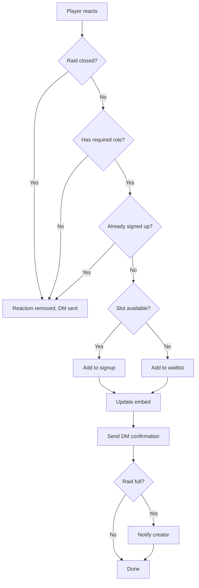

RaidBot uses Discord reactions as the primary signup mechanism. Players react to raid messages with specific emojis to claim roles or team slots.

## How Signups Work

The signup process varies based on raid type:

<Tabs>
  <Tab title="Regular Raids">
    Regular raids (Dragonspyre, Lemuria, Polaris) use role-based signups.

    <Steps>
      <Step title="Player reacts with role emoji">
        Each role has a unique emoji (⚔️, 🛡️, 💚, etc.).

        When a player reacts, the bot:
        1. Checks if the role is full
        2. Checks if the player is already signed up for another role
        3. Assigns the player to the role or waitlist
      </Step>

      <Step title="Embed updates automatically">
        The raid embed updates in real-time to show:
        - Player names linked to profiles
        - Side assignments (if applicable)
        - Waitlisted players (if role is full)
        - Raid leader badge (⭐) for designated leaders
      </Step>

      <Step title="DM confirmation sent">
        The bot sends a DM to the player:
        - If assigned: "You've been added to [Role Name]"
        - If waitlisted: "The [Role Name] role is full. You've been added to the waitlist..."
        - If already signed up: "You're already signed up for a role in this raid!..."
      </Step>
    </Steps>

    **Example embed update:**
    ```
    ⚔️ 🌩️ Storm 1 - [@Player1](link) - storm side, [@Player2](link) ⭐
    > Waitlist: 1. [@Player3](link)
    ```
  </Tab>

  <Tab title="Museum Signups">
    Museum signups use a simple checkmark system.

    <Steps>
      <Step title="Player reacts with ✅">
        Players react with ✅ to claim a slot.

        Maximum 12 players can sign up.
      </Step>

      <Step title="Assigned or waitlisted">
        - If slots available (< 12): Player is added to the signup list
        - If full (= 12): Player is added to the waitlist
      </Step>

      <Step title="Embed shows numbered list">
        ```
        Signups:
        1. [@Player1](link)
        2. [@Player2](link) ⭐
        3. [@Player3](link)
        ...
        Slots: 3/12

        Waitlist:
        1. [@Player4](link)
        ```
      </Step>
    </Steps>
  </Tab>

  <Tab title="Key Boss / Challenge Mode">
    Team-based signups for key bosses and challenge dungeons.

    <Steps>
      <Step title="Player reacts with team number">
        Players react with numbered emojis to join teams:
        - 1️⃣ Team 1
        - 2️⃣ Team 2
        - 3️⃣ Team 3
        - 4️⃣ Team 4

        Each team holds 4 players.
      </Step>

      <Step title="Assigned to team or waitlist">
        - If team has space (< 4): Player is added to the team
        - If team is full (= 4): Player is added to that team's waitlist
        - If player is on another team: Signup blocked
      </Step>

      <Step title="Teams shown with status">
        ```
        Team 1 (4/4) — FULL:
        1. [@Player1](link)
        2. [@Player2](link) ⭐
        3. [@Player3](link)
        4. [@Player4](link)

        Team 1 Waitlist:
        1. [@Player5](link)

        Team 2 (2/4):
        1. [@Player6](link)
        2. [@Player7](link)
        ```
      </Step>
    </Steps>
  </Tab>
</Tabs>

## Signup Rules

### One Role Per Raid

Players can only sign up for **one role** in a regular raid.

<Warning>
  If a player reacts to a second role while already signed up, their reaction is removed and they receive a DM:

  ```
  You're already signed up for a role in this raid! Please remove your
  current signup before choosing a different role.
  ```
</Warning>

To switch roles:
1. Remove your reaction from the current role
2. Wait for the embed to update
3. React to the new role

### One Team Per Signup

For key boss and challenge mode, players can only join **one team**.

Attempting to join multiple teams results in:
```
You're already signed up for Team 1. Remove your reaction there
first to switch teams.
```

### Role Restrictions

Servers can configure role requirements for signups using `/setsignuprole`.

If a player lacks the required role:
- Their reaction is removed
- They receive a DM listing required roles:
  ```
  You need one of these roles to sign up for this raid:
  > Guild Member
  > Trial Member
  If you need access, please reach out to a staff member.
  ```

### Rate Limiting

To prevent spam and abuse, RaidBot rate limits reactions:

- If a player reacts too quickly, their reaction is removed
- They receive: "You're reacting too quickly. Please wait a few seconds and try again."

## Waitlist System

When a role or team is full, players are added to a waitlist.

### How Waitlists Work

<Steps>
  <Step title="Player added to waitlist">
    When all slots are taken, new reactions go to the waitlist:

    ```
    > Waitlist: 1. [@Player](link), 2. [@Player2](link)
    ```
  </Step>

  <Step title="Slot opens">
    When someone removes their signup:
    1. The first person on the waitlist is promoted
    2. They receive a DM notification:
       ```
       🎉 A spot opened up! You've been promoted from the waitlist
       to [Role Name] in [Raid Name]!
       ```
    3. Their reaction is automatically moved from waitlist to active
  </Step>

  <Step title="Waitlist position updates">
    The embed updates to show the new waitlist order:
    ```
    > Waitlist: 1. [@Player2](link)
    ```
  </Step>
</Steps>

### Waitlist Behavior by Type

<Tabs>
  <Tab title="Regular Raids">
    Each role has its own independent waitlist.

    Removing from "Storm 1" only promotes from the "Storm 1" waitlist, not other roles.
  </Tab>

  <Tab title="Museum">
    Global waitlist for the entire signup.

    Any player removing their signup promotes the first person on the museum waitlist.
  </Tab>

  <Tab title="Teams">
    Each team has its own independent waitlist.

    Removing from Team 1 promotes from Team 1's waitlist, not Team 2's.
  </Tab>
</Tabs>

<Info>
  Waitlist tracking is automatic. Players don't need to do anything special - just keep their reaction on the message.
</Info>

## Race Condition Protection

RaidBot uses **mutex locks** to prevent race conditions during concurrent signups.

### Why This Matters

Without locking, if two players react at the same moment:
- Both might be added to the same "last slot"
- Counts could be incorrect
- Embed updates could conflict

### How It Works

<Steps>
  <Step title="Mutex acquired">
    When a reaction is added/removed, RaidBot acquires a mutex lock for that specific raid.
  </Step>

  <Step title="Signup processed">
    All signup logic runs:
    - Check availability
    - Update data
    - Modify embed
    - Send DMs
  </Step>

  <Step title="Mutex released">
    The lock is released, allowing the next queued reaction to process.
  </Step>
</Steps>

This ensures:
- Accurate slot counts
- Consistent waitlist order
- No duplicate signups
- Proper embed updates

## Signup Lifecycle



## Activity Tracking

RaidBot tracks player activity for participation stats:

<Tabs>
  <Tab title="Full Signup">
    When assigned to a role/team:
    - Activity timestamp updated
    - Counted toward "active players"
    - Recorded when raid closes
  </Tab>

  <Tab title="Waitlist">
    When added to waitlist:
    - Activity timestamp updated
    - Counted as active (shows engagement)
    - NOT counted as completed raid until promoted
  </Tab>

  <Tab title="Removal">
    When player removes signup:
    - No negative impact on stats
    - Allows others to join
    - Waitlist promoted if applicable
  </Tab>
</Tabs>

## Special Features

### Side Assignments

For raids with multi-side mechanics, raid leaders can assign sides:

```
⚔️ 🌩️ Storm 1 - [@Player1](link) - storm side
```

This is managed through the `/side` command, not reactions.

### Raid Leader Badge

Players with the configured raid leader role get a ⭐ badge:

```
🛡️ 🧱 Jade - [@LeaderName](link) ⭐
```

Configure the leader role with:
```bash
/settings leader_role:@Raid Leader
```

### Creator Notifications

When a raid fills up completely, the creator receives a DM:

```
Your raid "Dragonspyre (Voracious Void)" (ID: ABC123) is now full!
```

For team-based raids:
```
Your Gold Key Boss signup (ID: ABC123) is now full!
```

## Troubleshooting

<AccordionGroup>
  <Accordion title="Reaction was removed immediately">
    This can happen if:
    - The raid is closed
    - You're already signed up for another role
    - You lack the required signup role
    - You're reacting too quickly (rate limited)

    Check your DMs for a message from RaidBot explaining why.
  </Accordion>

  <Accordion title="Not receiving DM confirmations">
    Make sure:
    - You have DMs enabled from server members
    - You haven't blocked the bot
    - Your privacy settings allow DMs

    The bot cannot send DMs if these settings block it.
  </Accordion>

  <Accordion title="Embed not updating">
    The bot updates embeds automatically. If it doesn't update:
    - Wait a few seconds (processing queue)
    - Check bot permissions (needs "Manage Messages")
    - Contact a server admin if the issue persists
  </Accordion>

  <Accordion title="Can't switch roles">
    Remember to:
    1. Remove your current reaction first
    2. Wait for the embed to update (you'll see yourself removed)
    3. React to the new role

    You cannot react to multiple roles simultaneously.
  </Accordion>
</AccordionGroup>

## Best Practices for Players

<CardGroup cols={2}>
  <Card title="Sign up early" icon="clock">
    Popular roles fill quickly. Sign up as soon as the raid is posted to avoid the waitlist.
  </Card>
  
  <Card title="Remove if you can't attend" icon="user-slash">
    If your plans change, remove your reaction promptly so others can join from the waitlist.
  </Card>
  
  <Card title="Check your DMs" icon="envelope">
    RaidBot sends important confirmations and waitlist promotions via DM.
  </Card>
  
  <Card title="Respect the waitlist" icon="list-ol">
    If you're waitlisted, keep your reaction. You'll be promoted automatically when slots open.
  </Card>
</CardGroup>

## Next Steps

<CardGroup cols={2}>
  <Card title="Creating Raids" icon="plus" href="/guides/creating-raids">
    Learn how to create raid signups
  </Card>
  <Card title="Managing Raids" icon="sliders" href="/guides/managing-raids">
    Manage signups with the control panel
  </Card>
</CardGroup>